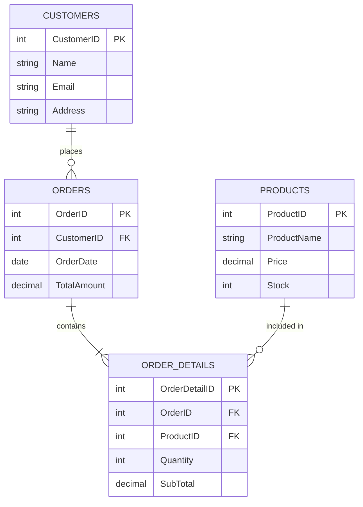
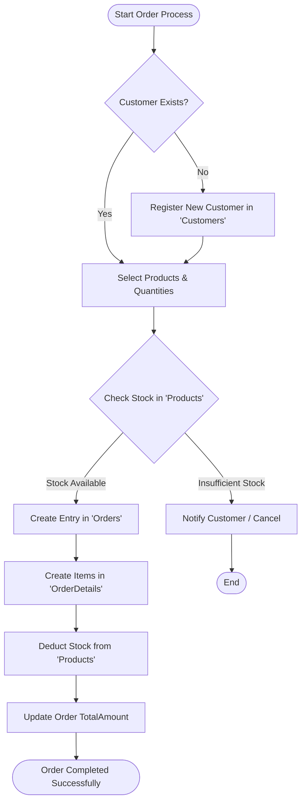
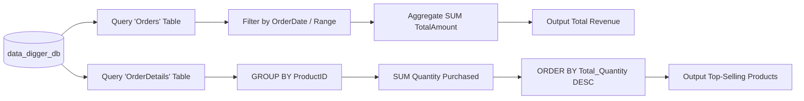

# 🔍 Data Digger SQL Database Project

[](https://www.mysql.com/)
[](# database-schema)
[](#license)

**Data Digger** is a comprehensive relational database system designed to model, manage, and analyze core e-commerce operations. The project demonstrates real-world transactional operations including customer management, order fulfillment, product inventory tracking, and sales revenue analytics using MySQL.

---

## 📋 Table of Contents
- [Entity Relationship Diagram (ERD)](#-entity-relationship-diagram-erd)
- [Database Schema & Architecture](#-database-schema--architecture)
- [Operational Flowcharts](#-operational-flowcharts)
  - [Customer Order Workflow](#1-customer-order-processing-flow)
  - [Sales Revenue Analytics Flow](#2-sales-revenue-analytics-flow)
- [Database Setup & Execution](#-database-setup--execution)
- [Key Queries & Analytical Insights](#-key-queries--analytical-insights)
- [License](#-license)

---

## 📐 Entity Relationship Diagram (ERD)

The database models a relational architecture linking **Customers**, **Orders**, **Products**, and **OrderDetails** using Primary and Foreign Key relationships.



---

## 🗄️ Database Schema & Architecture

### 1. `Customers` Table
Stores customer demographic details.

| Field | Type | Modifiers | Description |
| :--- | :--- | :--- | :--- |
| `CustomerID` | `INT` | `PRIMARY KEY` | Unique customer identifier |
| `Name` | `VARCHAR(100)` | `NOT NULL` | Full name of the customer |
| `Email` | `VARCHAR(100)` | `UNIQUE` | Email address |
| `Address` | `VARCHAR(200)` | — | Shipping/Billing address |

### 2. `Orders` Table
Tracks sales transactions placed by customers.

| Field | Type | Modifiers | Description |
| :--- | :--- | :--- | :--- |
| `OrderID` | `INT` | `PRIMARY KEY` | Unique order identifier |
| `CustomerID` | `INT` | `FOREIGN KEY` | References `Customers(CustomerID)` |
| `OrderDate` | `DATE` | `NOT NULL` | Date when the order was placed |
| `TotalAmount` | `DECIMAL(10,2)` | `NOT NULL` | Final total amount for the order |

### 3. `Products` Table
Manages inventory levels and pricing for store items.

| Field | Type | Modifiers | Description |
| :--- | :--- | :--- | :--- |
| `ProductID` | `INT` | `PRIMARY KEY` | Unique product identifier |
| `ProductName` | `VARCHAR(100)` | `NOT NULL` | Name of the product |
| `Price` | `DECIMAL(10,2)` | `NOT NULL` | Price per unit |
| `Stock` | `INT` | `DEFAULT 0` | Available quantity in stock |

### 4. `OrderDetails` Table
Junction table tracking line items associated with each order.

| Field | Type | Modifiers | Description |
| :--- | :--- | :--- | :--- |
| `OrderDetailID`| `INT` | `PRIMARY KEY` | Line item identifier |
| `OrderID` | `INT` | `FOREIGN KEY` | References `Orders(OrderID)` |
| `ProductID` | `INT` | `FOREIGN KEY` | References `Products(ProductID)` |
| `Quantity` | `INT` | `NOT NULL` | Number of items purchased |
| `SubTotal` | `DECIMAL(10,2)` | `NOT NULL` | Calculated cost (`Quantity * Unit Price`) |

---

## 🔄 Operational Flowcharts

### 1. Customer Order Processing Flow
Illustrates the transaction process from customer registration to order verification and database updates.



---

### 2. Sales Revenue Analytics Flow
Visualizes how reporting queries extract metrics across order and customer data.



---

## 🚀 Database Setup & Execution

Execute the following script sequentially in your MySQL client to set up and populate `data_digger_db`:

```sql
-- 1. Create and Select Database
CREATE DATABASE IF NOT EXISTS data_digger_db;
USE data_digger_db;

-- 2. Create Customers Table & Insert Data
CREATE TABLE Customers (
    CustomerID INT PRIMARY KEY,
    Name VARCHAR(100),
    Email VARCHAR(100),
    Address VARCHAR(200)
);

INSERT INTO Customers (CustomerID, Name, Email, Address) VALUES
(1, 'Alice', 'alice@gmail.com', 'Surat, Gujarat'),
(2, 'Rahul', 'rahul@gmail.com', 'Chikhli, Gujarat'),
(3, 'Priya', 'priya@gmail.com', 'Valsad, Gujarat'),
(4, 'John', 'john@gmail.com', 'Mumbai, Maharashtra');

-- 3. Create Orders Table & Insert Data
CREATE TABLE Orders (
    OrderID INT PRIMARY KEY,
    CustomerID INT,
    OrderDate DATE,
    TotalAmount DECIMAL(10,2),
    FOREIGN KEY (CustomerID) REFERENCES Customers(CustomerID)
);

INSERT INTO Orders (OrderID, CustomerID, OrderDate, TotalAmount) VALUES
(101, 1, '2026-09-15', 4700.00),
(102, 2, '2026-09-10', 1200.00),
(103, 1, '2026-09-01', 2500.00),
(104, 3, '2026-08-25', 800.00);

-- 4. Create Products Table & Insert Data
CREATE TABLE Products (
    ProductID INT PRIMARY KEY,
    ProductName VARCHAR(100),
    Price DECIMAL(10,2),
    Stock INT
);

INSERT INTO Products (ProductID, ProductName, Price, Stock) VALUES
(201, 'Laptop', 55000.00, 10),
(202, 'Smartphone', 25000.00, 20),
(203, 'Headphones', 1400.00, 50),
(204, 'Smart Watch', 3500.00, 15),
(205, 'Keyboard', 1200.00, 30),
(206, 'Mouse', 800.00, 25);

-- 5. Create OrderDetails Table & Insert Data
CREATE TABLE OrderDetails (
    OrderDetailID INT PRIMARY KEY,
    OrderID INT,
    ProductID INT,
    Quantity INT,
    SubTotal DECIMAL(10,2),
    FOREIGN KEY (OrderID) REFERENCES Orders(OrderID),
    FOREIGN KEY (ProductID) REFERENCES Products(ProductID)
);

INSERT INTO OrderDetails (OrderDetailID, OrderID, ProductID, Quantity, SubTotal) VALUES
(1, 101, 203, 2, 2800.00),
(2, 101, 205, 1, 1200.00),
(3, 102, 202, 1, 25000.00),
(4, 102, 206, 2, 1600.00),
(5, 103, 204, 1, 3500.00),
(6, 103, 203, 3, 4200.00),
(7, 104, 206, 2, 1600.00);
```

---

## 📊 Key Queries & Analytical Insights

### 1. Revenue & Order Summary Metrics
Calculate high-level financial aggregations across all completed orders:

```sql
SELECT 
    MAX(TotalAmount) AS Highest_Order,
    MIN(TotalAmount) AS Lowest_Order,
    AVG(TotalAmount) AS Average_Order_Value,
    SUM(TotalAmount) AS Total_Revenue
FROM Orders;
```

### 2. Top 3 Most Ordered Products
Identify best-selling products by quantity ordered:

```sql
SELECT 
    ProductID,
    SUM(Quantity) AS Total_Quantity_Sold
FROM OrderDetails
GROUP BY ProductID
ORDER BY Total_Quantity_Sold DESC
LIMIT 3;
```

### 3. Customer Order History Mapping
Extract detailed customer purchasing histories combining profile and order records:

```sql
SELECT 
    c.CustomerID,
    c.Name,
    o.OrderID,
    o.OrderDate,
    o.TotalAmount
FROM Customers c
JOIN Orders o ON c.CustomerID = o.CustomerID;
```

---
# 👨‍💻 Author

**Name:** Armin Khareghat

**Course:** MySQL Programming

**Project:** Data Digger

**Language:** MySQL

---
# ⭐ Thank You

Thank you for using the **Data Digger**.

## 📄 License
This project is open-source and available under the [MIT License](LICENSE).